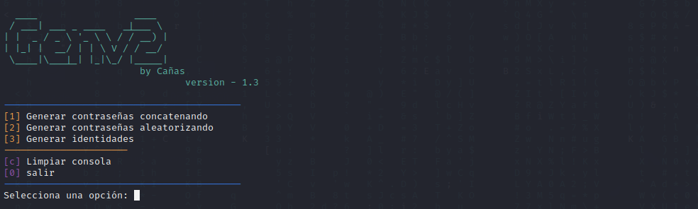

# GenV2
This is a tool for basic audits.


Generate passwords: it asks the user to input a series of words and the number of columns they want to create combinations. Then, all possible combinations are generated and saved to a file named "combinations.txt" in the same directory as the file.

Generate identities: it reads names and surnames from text files named "nombres.txt" and "apellidos.txt", and then generates 10 random identities with names, surnames, ages, and dates of birth. The generated names and surnames are chosen randomly from the text files.

Clear console: it clears the output console.

Quit: it exits the program.

The code uses Python libraries such as itertools, random, datetime, sys, and os to perform these operations. It also includes an ASCII banner at the top of the program

# Password generator.

To generate passwords, you only need to select option 1, which will take you to the password generator. You must input the words, letters, or numbers you want to combine or "concatenate", and to finish the character input, type "done". Then, you must specify the number of columns in which the combinations will be limited. Finally, everything will be saved in a text file as a password "


# Identity generator.

Here you will only need to select option 2, and it will automatically generate random and fake identities that you can use to create passwords together with the password generator, fill databases, obtain a quick identity or give it any other use.


# update
## New section

A new section has been added that modifies words entered by the user, mixing upper and lowercase letters. This generates a list that is saved in the same way as the concatenator, in a text file for later brute force testing.

The new section uses the function generate_modifications which takes a word as input and generates a list of variations by randomly capitalizing letters. The variations are then saved to a text file using the same format as the generate_passwords function.

To use this section, the user simply needs to call the generate_modifications function with their desired word as an argument. The resulting variations will be saved in a new text file named "modifications.txt" in the same directory as the script.

This new section provides a convenient way to generate a large number of password variations quickly for use in security testing or other purposes.


## New console user interface

In addition, the visual interface of the main menu in the console has been improved, which allows for more intuitive navigation thanks to the inclusion of buttons with an enhanced design.



# Install:
```bash
git clone https://github.com/RodrigoDCP/GenV2.git 
```

```bash                              
cd GenV2
```

```bash
python3 menu.py
```
